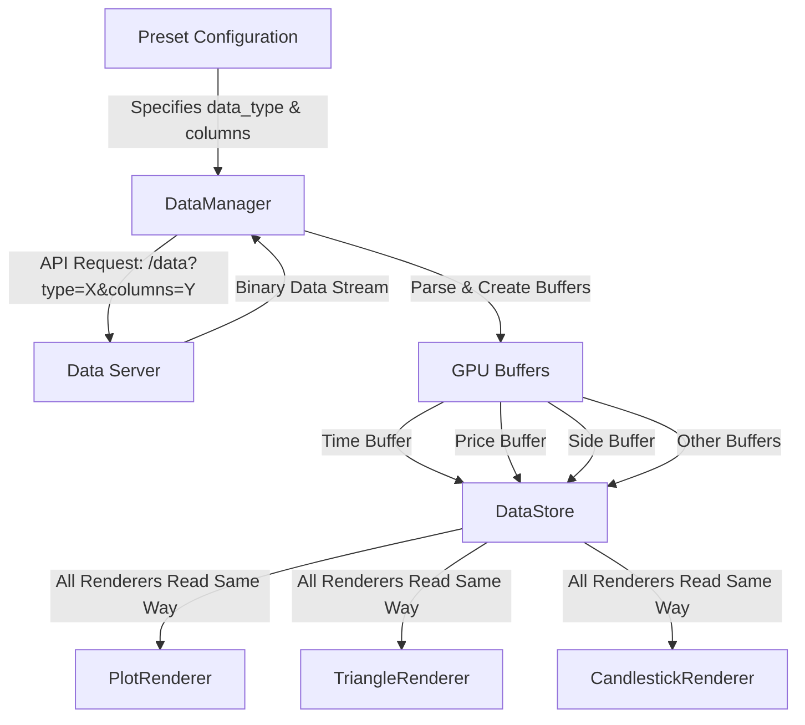

# Preset-Based Data Flow Plan

## Overview
All data flows through the same pipeline regardless of renderer type. The preset configuration drives what data to fetch and how to render it.

## Core Principle
**"Data is data"** - Whether it's market data for lines or trade data for triangles, it all flows through GPU buffers in the same way.

## Data Flow Diagram



## Preset Configuration Example

```rust
// Market Data Preset
ChartPreset {
    render_type: RenderType::Line,
    data_columns: vec![
        ("md", "best_bid"),     // data_type = "md"
        ("md", "best_ask"),     // columns = ["time", "best_bid", "best_ask"]
    ],
    ...
}

// Trades Preset
ChartPreset {
    render_type: RenderType::Triangle,
    data_columns: vec![
        ("trades", "price"),    // data_type = "trades"
        ("trades", "side"),     // columns = ["time", "price", "side"]
    ],
    ...
}
```

## Implementation Steps

### 1. Update DataManager::fetch_data
```rust
pub async fn fetch_data(
    &mut self,
    symbol: &str,
    data_type: &str,  // NEW: from preset config
    columns: Vec<String>,  // From preset data_columns
    start_time: u64,
    end_time: u64,
) -> Result<DataHandle>
```

### 2. API Request Format
```
// Current:
/api/data?symbol=BTC-USD&start=123&end=456&columns=time,best_bid

// New (with data_type):
/api/data?symbol=BTC-USD&type=md&start=123&end=456&columns=time,best_bid
/api/data?symbol=BTC-USD&type=trades&start=123&end=456&columns=time,price,side
```

### 3. Buffer Creation (No Changes!)
```rust
// All data types create buffers the same way:
let time_buffer = create_gpu_buffer(&time_data);
let price_buffer = create_gpu_buffer(&price_data);
let side_buffer = create_gpu_buffer(&side_data);
// etc...
```

### 4. Renderer Data Access

#### PlotRenderer (Current - No Changes)
```rust
// Reads from DataStore metrics
let y_values = data_store.get_metric_buffer("best_bid");
```

#### TriangleRenderer (Updated to use buffers)
```rust
// Instead of TradeData structs, read directly from buffers:
let time_buffer = data_store.get_buffer("time");
let price_buffer = data_store.get_buffer("price");
let side_buffer = data_store.get_buffer("side");

// In shader: instance data from buffers
@vertex
fn vs_main(@builtin(instance_index) instance: u32) {
    let time = time_data[instance];
    let price = price_data[instance];
    let side = side_data[instance];
    // Generate triangle based on side (0=sell, 1=buy)
}
```

## Key Changes Required

### 1. DataManager
- Add `data_type` parameter to `fetch_data`
- Include `type` in API request URL
- Cache key should include data_type

### 2. Preset Processing (wasm-bridge)
```rust
// When applying preset:
for chart_preset in &preset.chart_types {
    // Extract unique data types
    let data_type = &chart_preset.data_columns[0].0;  // e.g., "md" or "trades"
    let columns = chart_preset.data_columns.iter()
        .map(|(_, col)| col.clone())
        .collect();
    
    // Fetch data for this type
    data_manager.fetch_data(symbol, data_type, columns, start, end).await?;
}
```

### 3. TriangleRenderer
- Update to read from GPU buffers instead of TradeData array
- Modify shader to use instance data from buffers
- Side buffer: 0 = sell (red, down), 1 = buy (green, up)

### 4. DataStore
- Add method to get buffer by name (not just metrics)
- Track which buffers belong to which data type

## Benefits of This Approach

1. **Simplicity**: One data flow for all renderer types
2. **Performance**: All data in GPU buffers, no CPU-side transformation
3. **Flexibility**: Easy to add new data types and renderers
4. **Consistency**: All renderers work the same way

## Example Flow: Bid/Ask + Trades Preset

```yaml
1. User selects "Bid/Ask + Trades" preset
2. Preset contains:
   - Line renderer: data_type="md", columns=["best_bid", "best_ask"]
   - Triangle renderer: data_type="trades", columns=["price", "side"]

3. DataManager makes two API calls:
   - /api/data?type=md&columns=time,best_bid,best_ask
   - /api/data?type=trades&columns=time,price,side

4. Creates GPU buffers:
   - md_time_buffer, md_best_bid_buffer, md_best_ask_buffer
   - trades_time_buffer, trades_price_buffer, trades_side_buffer

5. Renderers read their data:
   - PlotRenderer: reads md_* buffers
   - TriangleRenderer: reads trades_* buffers

6. MultiRenderer combines both outputs
```

## Next Steps

1. Update DataManager to accept data_type parameter
2. Modify TriangleRenderer to read from GPU buffers
3. Update preset application logic in wasm-bridge
4. Test with real market data

This approach maintains the elegant simplicity of the current system while extending it to support multiple data types and renderers.