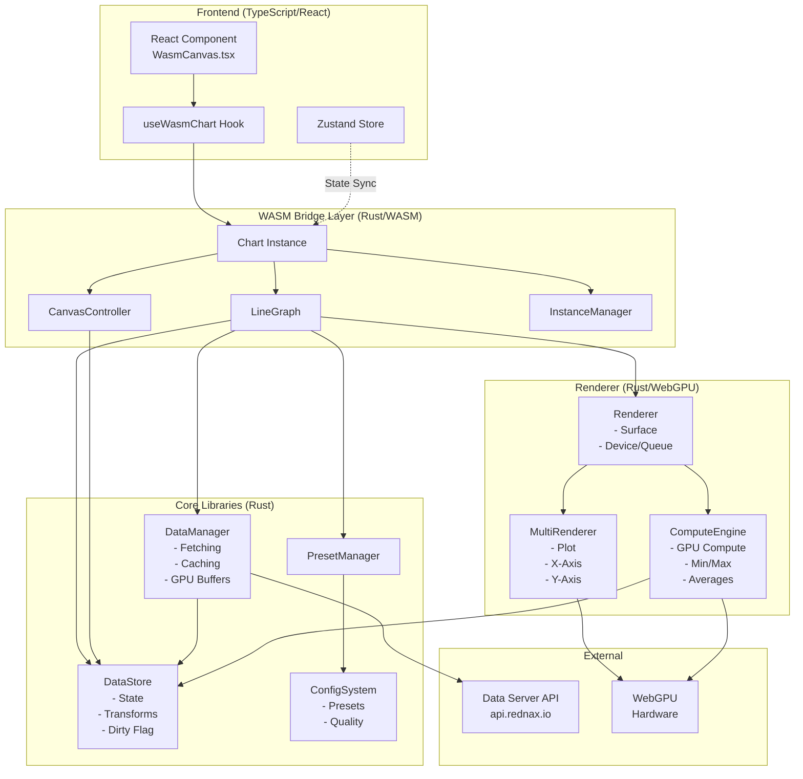
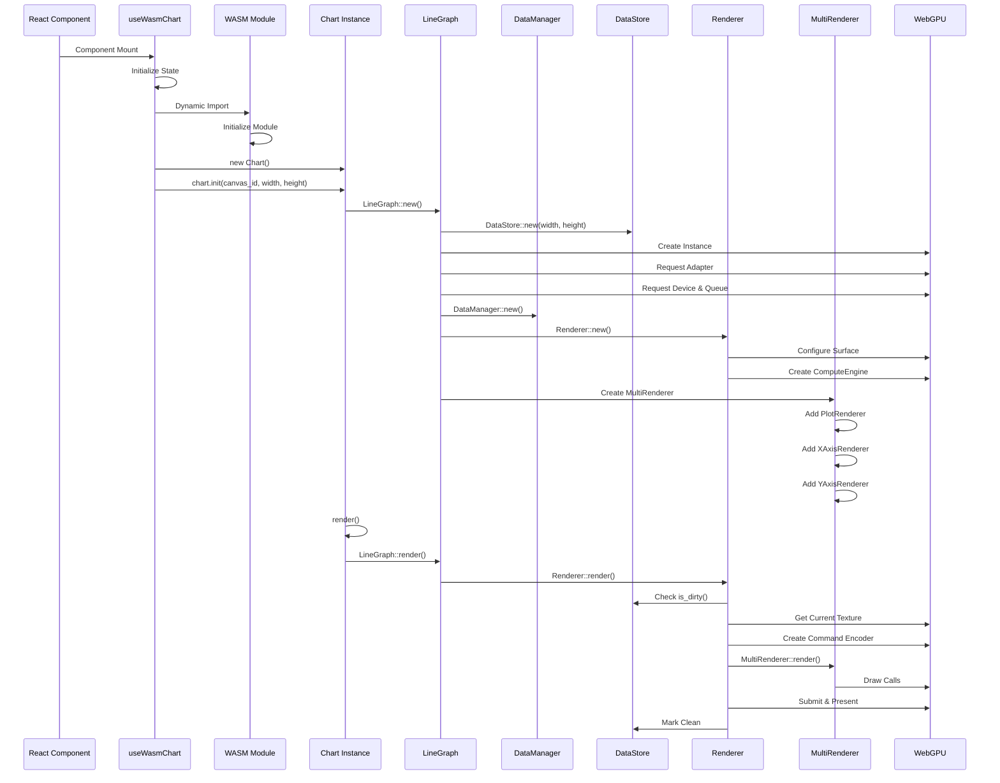
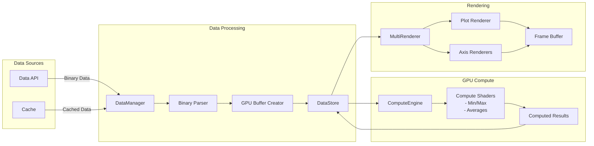
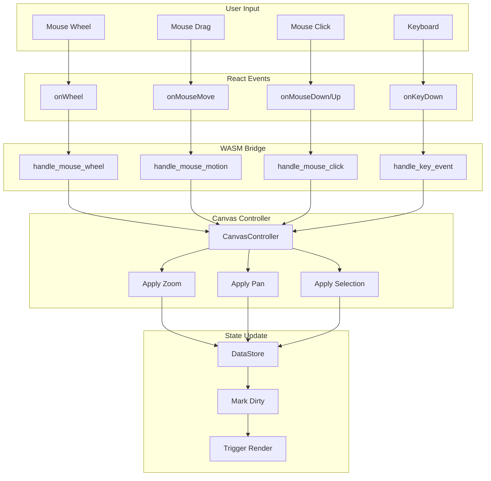
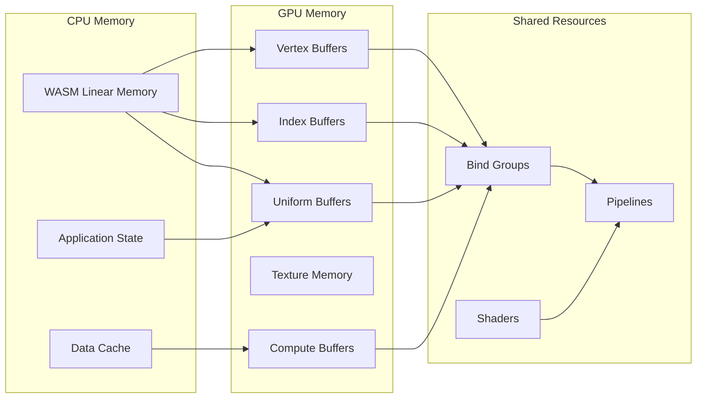

# GPU-Charts Architecture Diagram

## High-Level Architecture

## First Render Method Call Sequence

## Data Flow Diagram

## Event Handling Flow

## Performance-Critical Paths

```mermaid
graph TD
    subgraph "Hot Path 1: Render Loop"
        RAF[requestAnimationFrame]
        CHECK[Check needs_render]
        RENDER[Execute render]
        GPU[GPU Draw]
    end
    
    subgraph "Hot Path 2: Data Updates"
        FETCH[Fetch Data]
        GPUBUF[Create GPU Buffers]
        COMPUTE[GPU Compute]
        UPDATE[Update State]
    end
    
    subgraph "Hot Path 3: User Interaction"
        EVENT[User Event]
        TRANSFORM[Transform Coords]
        STATE[Update State]
        RERENDER[Re-render]
    end
    
    RAF --> CHECK
    CHECK -->|dirty| RENDER
    CHECK -->|clean| RAF
    RENDER --> GPU
    GPU --> RAF
    
    FETCH --> GPUBUF
    GPUBUF --> COMPUTE
    COMPUTE --> UPDATE
    
    EVENT --> TRANSFORM
    TRANSFORM --> STATE
    STATE --> RERENDER
```

## Memory Management

## Key Performance Optimizations

1. **Zero-Copy Data Path**: Memory-mapped files → GPU buffers
2. **GPU Compute**: All heavy calculations on GPU
3. **Smart Dirty Tracking**: Only re-render when needed
4. **Efficient Buffer Management**: Reuse GPU resources
5. **Async Pipeline**: Non-blocking render loop
6. **Cached API Calls**: Minimize network requests
7. **Batched Updates**: Group state changes
8. **Optimized Shaders**: Minimal GPU instructions