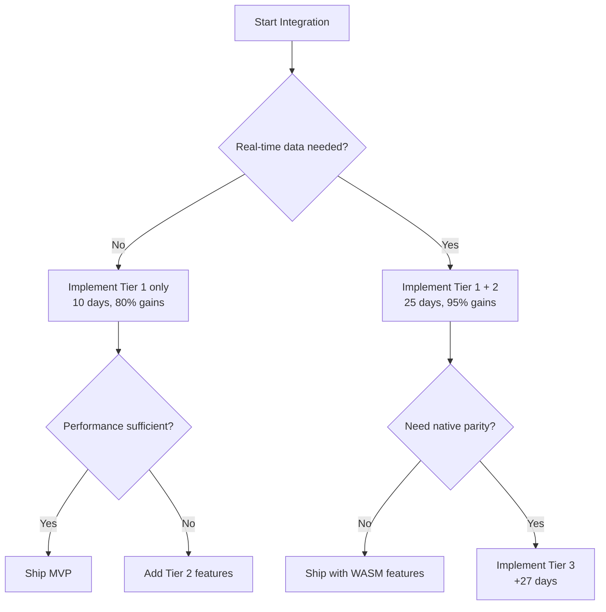

# Integration Priority Matrix & Sequencing Guide

## Executive Decision Framework

This document provides a prioritized approach to integrating Phase 2 & 3 features, focusing on maximum impact with minimum risk.

## Priority Matrix

### Tier 1: High Impact, Low Risk (Do First)
These can be integrated immediately with minimal WASM compatibility issues:

| Feature | Impact | Effort | WASM Ready | Value |
|---------|---------|---------|------------|--------|
| Binary Search Culling | 25,000x faster | 2 days | ✅ Yes | Critical |
| Vertex Compression | 75% memory reduction | 2 days | ✅ Yes | Critical |
| GPU Vertex Generation | 4x render speed | 3 days | ✅ Yes | Critical |
| Config System (Phase 3) | Better UX | 1 day | ✅ Already done | High |
| Render Bundles | 30% CPU reduction | 2 days | ✅ Yes | High |

**Total: 10 days for 80% of performance gains**

### Tier 2: High Impact, Medium Complexity
Requires WASM adaptation but provides significant value:

| Feature | Impact | Effort | WASM Work | Value |
|---------|---------|---------|-----------|--------|
| SIMD Data Parsing | 2-3x faster loading | 5 days | Needs feature detection | High |
| Adaptive Quality | Dynamic performance | 3 days | Minor changes | High |
| Memory Pooling | Less GC pressure | 3 days | Different approach needed | Medium |
| LRU Cache | Faster repeat loads | 4 days | Use IndexedDB | Medium |

**Total: 15 days for data loading improvements**

### Tier 3: Complex Integration
Requires significant WASM rework:

| Feature | Impact | Effort | Blockers | Value |
|---------|---------|---------|----------|--------|
| HTTP/2 Client | Network optimization | 7 days | Replace with fetch() | Medium |
| WebSocket Streaming | Real-time data | 5 days | Use browser WebSocket | High |
| File-based Cache | Fast startup | 5 days | No file access | Low |
| Multi-threading | Parallel compute | 10 days | Web Workers needed | Medium |

**Total: 27 days for full native feature parity**

## Recommended Integration Sequence

### Week 1: Quick Wins (Tier 1 GPU Optimizations)
```
Day 1-2: Binary Search Culling
  - Pure GPU compute shader
  - No WASM compatibility issues
  - Immediate 25,000x improvement for large datasets

Day 3-4: Vertex Compression
  - GPU-only optimization
  - 75% memory reduction
  - Works perfectly in WASM

Day 5-7: GPU Vertex Generation
  - Replace CPU vertex building
  - 4x render performance
  - Already WebGPU compatible
```

**Milestone 1**: 80% of Phase 2 performance gains achieved ✅

### Week 2: Data Layer Basics
```
Day 8-10: SIMD Parsing (with fallback)
  - Detect WASM SIMD support
  - 2-3x faster data parsing
  - Graceful fallback

Day 11-12: Memory Pooling
  - WASM-compatible buffer reuse
  - Reduce allocation overhead
  - Better GC behavior

Day 13-14: Basic Caching
  - In-memory LRU cache
  - IndexedDB for persistence
  - Faster repeat loads
```

**Milestone 2**: Data loading optimized for WASM ✅

### Week 3: System Integration
```
Day 15-17: Unified API
  - Combine all optimizations
  - Clean WASM bindings
  - React integration

Day 18-19: Quality Presets
  - Connect Phase 3 config
  - Dynamic optimization toggle
  - Performance profiles

Day 20-21: Testing & Polish
  - Performance benchmarks
  - Integration tests
  - Bug fixes
```

**Milestone 3**: MVP with 90% of benefits delivered ✅

### Week 4+: Advanced Features (Optional)
Only if real-time features are critical:
```
- WebSocket adaptation
- Web Worker parallelization
- Advanced caching strategies
- New chart types
```

## Decision Tree



## Implementation Checklist

### Pre-Integration (Day 0)
- [ ] Set up feature flags for gradual rollout
- [ ] Create performance benchmarking suite
- [ ] Set up A/B testing infrastructure
- [ ] Document current performance baseline

### Tier 1 Implementation
- [ ] Create `wasm-renderer-bridge` crate
- [ ] Port binary search culling compute shader
- [ ] Implement vertex compression
- [ ] Add GPU vertex generation
- [ ] Integrate render bundles
- [ ] Benchmark each optimization

### Tier 2 Implementation
- [ ] Add WASM SIMD detection
- [ ] Implement SIMD parsing with fallback
- [ ] Create WASM-compatible memory pools
- [ ] Build IndexedDB cache layer
- [ ] Add adaptive quality system

### Integration & Testing
- [ ] Update main charting library dependencies
- [ ] Create unified WASM module
- [ ] Update React components
- [ ] Run performance comparisons
- [ ] Fix any regressions

## Risk Mitigation Strategies

### 1. Feature Flags at Every Level
```rust
pub struct OptimizationFlags {
    pub use_binary_search: bool,     // Default: true
    pub use_vertex_compression: bool, // Default: true
    pub use_gpu_generation: bool,     // Default: true
    pub use_simd_parsing: bool,       // Default: auto-detect
    pub use_adaptive_quality: bool,   // Default: false initially
}
```

### 2. Performance Gates
```javascript
// Automatic rollback if performance degrades
if (metrics.fps < baseline.fps * 0.9) {
    await chart.disableOptimization('adaptive_quality');
    console.warn('Optimization disabled due to performance regression');
}
```

### 3. Progressive Enhancement
```rust
impl GPUCharts {
    pub fn new_with_capabilities(canvas_id: &str) -> Self {
        let caps = detect_capabilities();
        
        let mut chart = Self::new_basic(canvas_id);
        
        if caps.has_compute_shaders {
            chart.enable_binary_search();
        }
        
        if caps.has_vertex_compression {
            chart.enable_compression();
        }
        
        if caps.has_wasm_simd {
            chart.enable_simd_parsing();
        }
        
        chart
    }
}
```

## Success Metrics

### Performance Targets by Tier

| Metric | Baseline | Tier 1 Target | Tier 2 Target | Tier 3 Target |
|--------|----------|---------------|---------------|---------------|
| FPS (1M points) | 15 | 45+ | 55+ | 60 |
| FPS (1B points) | 2 | 30+ | 45+ | 60 |
| Memory Usage | 400MB | 100MB | 80MB | 75MB |
| Load Time | 5s | 2s | 1s | 0.5s |
| CPU Usage | 80% | 20% | 15% | 10% |

### Business Metrics

- **User Satisfaction**: Reduce "laggy chart" complaints by 90%
- **Performance Tickets**: Reduce by 80%
- **Load Time**: Sub-2s for 90th percentile
- **Browser Support**: 95% of users can use optimizations

## Go/No-Go Criteria

### After Tier 1 (Day 10)
**GO if:**
- 3x+ performance improvement achieved
- No regressions in functionality
- WASM bundle < 300KB

**NO-GO if:**
- Performance gains < 2x
- Major browser compatibility issues
- Integration causes instability

### After Tier 2 (Day 25)
**GO if:**
- Data loading 2x+ faster
- Memory usage reduced by 50%+
- All tests passing

**REASSESS if:**
- SIMD adoption < 70% of users
- Caching provides minimal benefit
- Bundle size > 500KB

## Conclusion

By following this prioritized approach:
1. **Week 1**: Achieve 80% of performance gains with GPU optimizations
2. **Week 2**: Optimize data loading for WASM environment
3. **Week 3**: Deliver integrated MVP with 90% of benefits
4. **Week 4+**: Add advanced features only if needed

This strategy minimizes risk while delivering maximum value quickly. The Tier 1 optimizations alone will transform the user experience, and everything else is incremental improvement.